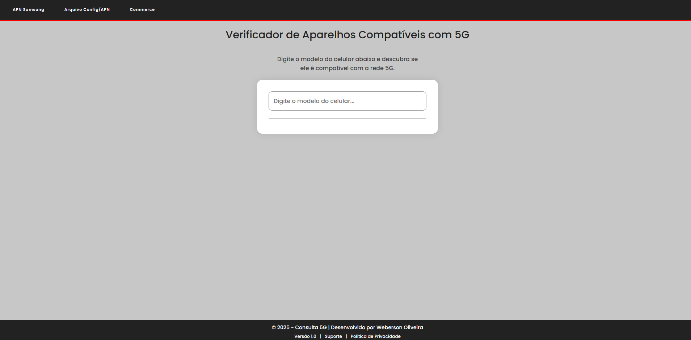
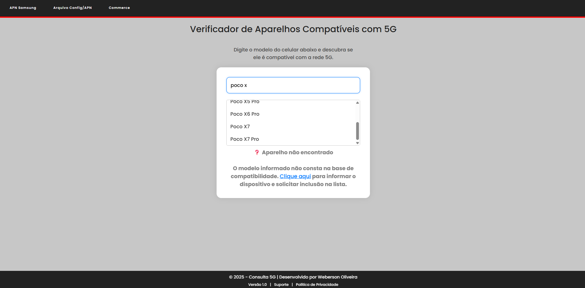
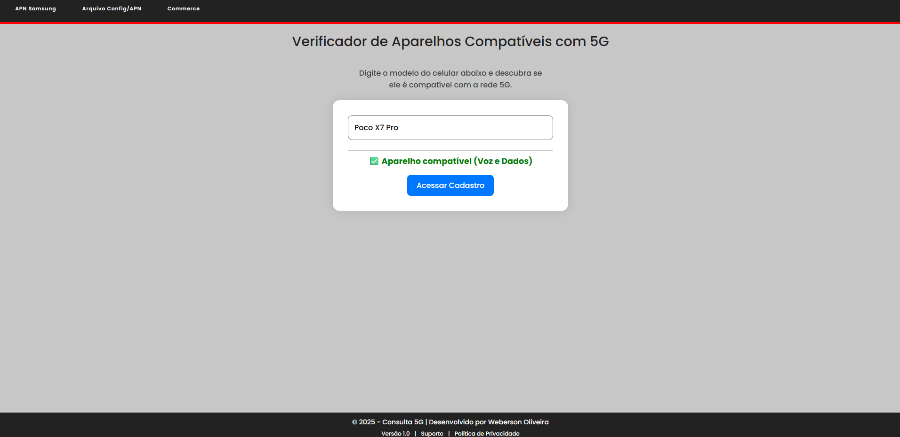

# Consulta 5G - Verificador de Compatibilidade de Aparelhos


---

## Visão Geral

O **Consulta 5G** é uma aplicação web leve e intuitiva desenvolvida para agilizar o trabalho dos técnicos em campo da [Nome da Empresa], permitindo a verificação rápida e precisa da compatibilidade dos modelos de celulares com a rede 5G.

Essa ferramenta elimina a necessidade de consultas manuais e documentação extensa, proporcionando uma experiência fluida para os profissionais durante os atendimentos.

---

## Funcionalidades

- **Busca inteligente:** Sugestões em tempo real conforme o usuário digita o modelo do aparelho.
- **Compatibilidade detalhada:** Indica se o aparelho é compatível com voz e dados, apenas dados ou incompatível com a rede 5G.
- **Acesso rápido:** Botão para direcionar o técnico diretamente à página de cadastro do chip 5G para aparelhos compatíveis.
- **Atualização simples:** Base de dados em arquivo JSON, facilitando a manutenção e expansão da lista de aparelhos.

---

## Tecnologias Utilizadas

- **HTML5** para estrutura semântica da página.
- **CSS3** para estilização responsiva e agradável.
- **JavaScript (Vanilla)** para lógica de busca, filtro e interação.
- **JSON** para armazenamento dinâmico da base de modelos compatíveis.

---

## Estrutura do Projeto

```
/
├── index.html          # Arquivo principal da aplicação
├── style.css           # Estilos CSS para o layout
├── main.js             # Script JavaScript para funcionalidades da busca
└── data/
    └── modelos.json    # Base de dados com modelos de aparelhos
└── img
    └──resultado.png
    └──sugestões.png
    └──tela principal.png
```
## Screenshots

### Tela principal e busca



### Sugestões dinâmicas ao digitar



### Resultado de compatibilidade


---

## Instalação e Uso

1. Clone este repositório:
   ```bash
   git clone https://github.com/seuusuario/consulta5g.git
   ```
2. Navegue até a pasta do projeto:
   ```bash
   cd consulta5g
   ```
3. Abra o arquivo `index.html` em seu navegador preferido (Google Chrome, Firefox, Edge etc.).
4. Utilize a barra de pesquisa para digitar e consultar o modelo do aparelho.
5. Se o aparelho for compatível, utilize o botão para acessar o cadastro do chip 5G.

---

## Atualização da Base de Dados

Para manter a base de aparelhos atualizada, edite o arquivo `data/modelos.json` seguindo o formato:

```json
{
  "vozEDados": ["Modelo 1", "Modelo 2"],
  "dadosApenas": ["Modelo Dados 1", "Modelo Dados 2"],
  "incompativeis": ["Modelo Não Compatível 1", "Modelo Não Compatível 2"]
}
```

---

## Contribuição

Contribuições são bem-vindas! Para colaborar:

1. Faça um fork deste repositório.
2. Crie uma branch para sua feature (`git checkout -b feature/nome-da-feature`).
3. Faça commit das suas alterações (`git commit -m 'Adicionei uma nova feature'`).
4. Envie para o branch original (`git push origin feature/nome-da-feature`).
5. Abra um Pull Request descrevendo suas modificações.

---

## Contato

Desenvolvido por **Weberson Oliveira**  
E-mail: tif2017c@gmail.com  
LinkedIn: [[Weberson Oliveira](www.linkedin.com/in/josé-weberson)  ](https://www.linkedin.com/in/jos%C3%A9-weberson/)

---


© 2025 Weberson Oliveira  
